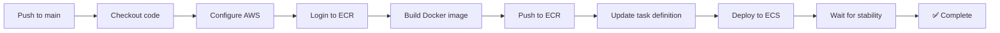

# GitHub Actions CI/CD - Guía de Configuración

## 📋 Descripción

Este workflow automatiza el deployment a AWS ECS cada vez que haces push a la rama `main`.

## 🔧 Configuración Inicial

### 1. Crear IAM User para GitHub Actions

```bash
# Crear usuario
aws iam create-user --user-name github-actions-deployer

# Crear política personalizada
cat > github-actions-policy.json <<EOF
{
  "Version": "2012-10-17",
  "Statement": [
    {
      "Effect": "Allow",
      "Action": [
        "ecr:GetAuthorizationToken",
        "ecr:BatchCheckLayerAvailability",
        "ecr:GetDownloadUrlForLayer",
        "ecr:BatchGetImage",
        "ecr:PutImage",
        "ecr:InitiateLayerUpload",
        "ecr:UploadLayerPart",
        "ecr:CompleteLayerUpload"
      ],
      "Resource": "*"
    },
    {
      "Effect": "Allow",
      "Action": [
        "ecs:DescribeTaskDefinition",
        "ecs:RegisterTaskDefinition",
        "ecs:UpdateService",
        "ecs:DescribeServices"
      ],
      "Resource": "*"
    },
    {
      "Effect": "Allow",
      "Action": [
        "iam:PassRole"
      ],
      "Resource": [
        "arn:aws:iam::150506369483:role/checkout-commerce-prod-ecs-task-execution-role",
        "arn:aws:iam::150506369483:role/checkout-commerce-prod-ecs-task-role"
      ]
    }
  ]
}
EOF

# Aplicar política
aws iam put-user-policy \
  --user-name github-actions-deployer \
  --policy-name GithubActionsDeployPolicy \
  --policy-document file://github-actions-policy.json

# Crear access keys
aws iam create-access-key --user-name github-actions-deployer
```

**Guarda el output (Access Key ID y Secret Access Key)**

### 2. Configurar GitHub Secrets

Ve a tu repositorio en GitHub:
```
Settings → Secrets and variables → Actions → New repository secret
```

Agrega estos secrets:

| Secret Name              | Value                                    |
|-------------------------|------------------------------------------|
| `AWS_ACCESS_KEY_ID`     | Access Key del paso anterior             |
| `AWS_SECRET_ACCESS_KEY` | Secret Access Key del paso anterior      |

### 3. Actualizar variables en el workflow

Verifica que las variables en [.github/workflows/deploy.yml](.github/workflows/deploy.yml#L10-L15) coincidan con tu infraestructura:

```yaml
env:
  AWS_REGION: us-east-1
  ECR_REPOSITORY: checkout-commerce-prod
  ECS_CLUSTER: checkout-commerce-prod-cluster
  ECS_SERVICE: checkout-commerce-prod-service
  CONTAINER_NAME: checkout-commerce-app  # ⚠️ Debe coincidir con el nombre en task definition
```

## 🚀 Uso

### Deployment Automático
```bash
git add .
git commit -m "feat: nueva funcionalidad"
git push origin main  # Esto dispara el workflow automáticamente
```

### Deployment Manual
1. Ve a GitHub: `Actions` → `Deploy to AWS ECS`
2. Click en `Run workflow`
3. Selecciona la rama
4. Click en `Run workflow`

## 📊 Monitoreo del Deployment

1. **GitHub Actions**: Ve a la pestaña `Actions` en GitHub para ver logs en tiempo real
2. **AWS Console**: 
   - ECS → Clusters → checkout-commerce-prod-cluster → Services
   - CloudWatch Logs → `/ecs/checkout-commerce-prod`

## 🔍 Verificación Post-Deployment

```bash
# Obtener URL del ALB
terraform output application_url

# Verificar health check
curl http://<ALB-URL>/api/health

# Ver logs del contenedor
aws logs tail /ecs/checkout-commerce-prod --follow
```

## 🎯 Flujo del Workflow



## 🛠️ Troubleshooting

### Error: "Cannot login to ECR"
- Verifica que los secrets AWS estén configurados correctamente
- Confirma que el IAM user tenga permisos `ecr:GetAuthorizationToken`

### Error: "Task definition not found"
- Asegúrate de haber ejecutado `terraform apply` primero
- Verifica el nombre de la task definition en AWS Console

### Error: "Service failed to stabilize"
- Revisa los logs en CloudWatch: `/ecs/checkout-commerce-prod`
- Verifica health checks del ALB
- Confirma que el puerto 3000 esté expuesto correctamente

## 📝 Mejoras Futuras

- [ ] Agregar stage de testing antes del deployment
- [ ] Implementar rollback automático en caso de fallo
- [ ] Agregar notificaciones a Slack/Discord
- [ ] Crear ambiente de staging (branch `develop`)
- [ ] Implementar blue/green deployments

## 🔐 Seguridad

- ✅ Nunca commitees credenciales AWS en el código
- ✅ Usa GitHub Secrets para información sensible
- ✅ El IAM user tiene permisos mínimos necesarios
- ✅ Las imágenes Docker se escanean en ECR
